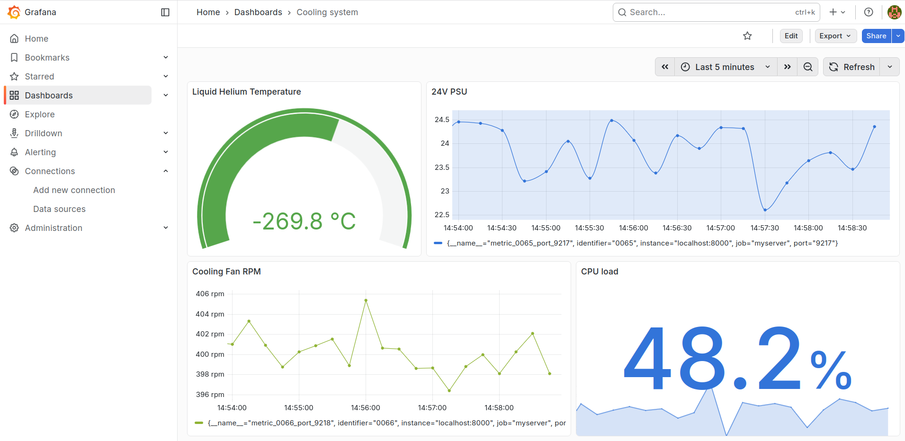

# FPGA-centric Slow Control Interlock System (SCIS)

This Project aims to build a Slow Control Interlock System, based on a Supervisory Monitoring Unit implemented on a Cologne Chip GateMate M1A1 FPGA and utilizing the W5500 Ethernet platform.

## Infrastructure overview

## Metric Packet Sources

Currently Metric Packets start with a protocol code (V01), contain a device identifier and end with metric value (Q22.10 signed fixed point).
These packets can stem from various Metric Providers / data acquisition systems (DAQ) and are forwarded to the GateMate M1A1 FPGA.
By using the W5500 Ethernet platform, Metric Packets can arrive over Ethernet as UDP packets and be forwarded to the Data Concentrator implemented on GateMate FPGA fabric.

### CAN bus metric channel

Metric Packets can also arrive over CAN: a CAN node core (`hardware/hdl/can/`) receives frames
on `can_rx` (PMOD B pin 7, `IO_NB_B4`) and acknowledges the accepted ones on `can_tx`
(PMOD B pin 8, `IO_NB_B5`) — 125 kbps, standard 11-bit IDs, CRC-15 checked. The board currently
ships wiring config (B): `can_rx`, `can_tx` and the remote controller's TX/RX all on one shared
wire with a 1k–2.2k pull-up to 3V3, a wired-AND bus with no transceiver. The two other
configurations (two-wire echo, and a real TJA1051T/3 transceiver bus) are selected by generics —
see [`hardware/README.md`](hardware/README.md).

Each received frame is converted into a 9-byte V01 Metric Packet and fed to the Data
Concentrator as a second input channel. The CAN ID *is* the DeviceTypeID:
`metric identifier = CAN ID << 6`, so the threshold lookup memory addresses are `2*ID` (lower)
and `2*ID + 1` (upper). LED D8 blinks on every received CAN frame.

## GateMate FPGA platform

The GateMate M1A1 Evaluation Board V3.2 was used with two SPI W5500 Ethernet modules and using one ESP32 for testing external interlock assertion.

Bitstream was uploaded onto the 64Mb SPI flash memory (SPI-MODE: quad) for fast FPGA reconfiguration.

### Slow Control Software Architecture

The Software architecture consists of a Metric Packet Server, Prometheus and Grafana

Source Code, testing and configuration files are found in /software_infrastructure

The whole stack runs under Docker Compose (`software_infrastructure/docker-compose.yml`):
the containerized Metric Packet Server (`:8001`, device metadata in
`MetricPacketServer/slow_control_catalog.json`), Prometheus (`:9090`) and Grafana (`:3300`,
auto-provisioned data source and SCIS dashboards). Device names, units, subsystems, warning
and interlock limits are **generated from
`software_infrastructure/Slow_control_protocol_example.csv`**, which also generates the FPGA's
threshold BRAM — so the board and the dashboards enforce and display the same numbers. See
[`software_infrastructure/README.md`](software_infrastructure/README.md) for the quickstart
and `testing_scripts/` (device simulator, RTT/port tests, CAN interlock check) for exercising
the board end-to-end.

## Current Project State

Working:
- W5500 controller (UDP) with round robin through all 8 sockets
- W5500 controller "send_first" and "receive_first" default routines
- Highest priority first readout from Priority FIFOs in Metric Packet Manager
- Implements at 40 MHz FPGA sys_clk speed
- Dual W5500, one for RX and one for TX
- Protocol Code V01 (signed Q22.10 values)
- Data concentrator/Supervisory Monitoring Unit with UDP packet adapter, Metric Packet Manager and first version of interlock protocol code V01 Metric Packets
- CAN metric channel (125 kbps, 11-bit IDs) as a second Data Concentrator input, acknowledging accepted frames; CAN ID == DeviceTypeID
- Interlock limits and dashboard metadata generated from one slow-control CSV (`build_slow_control_catalog.py`)
- Multi-channel Metric Packet Manager arbiter (round-robin deadlock for >1 input channel fixed) and telemetry drain fixes, covered by a layered GHDL regression suite (`make sim_drain_suite`)

ToDo/Bug:
- RX W5500 sometimes closes socket, when bombarded with UDP packets that exceed the 2KB RX Buffer

Backlog : 
- W5500 Controller for TCP packets (strips the UDP Packet Header from tdata on AXI-stream data transmission)
