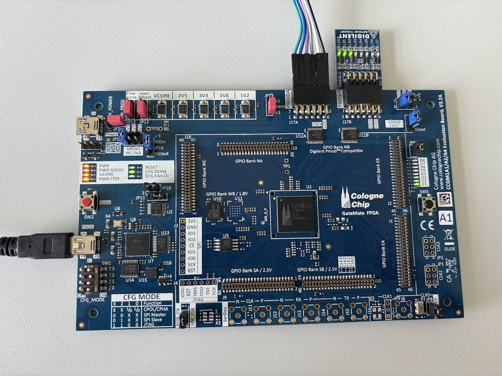
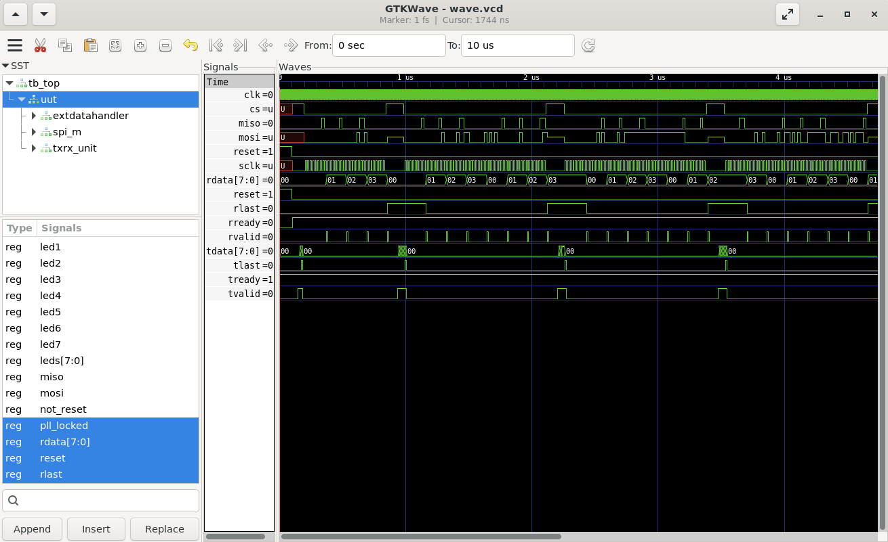

# GATEMATE CCGM1A1 Full workflow for VHDL projects
This repository refers to the oss-cad-suite (December 2025) provided by GateMate/Cologne Chip and explains VHDL synthesis, implementation (place and route), Bitstream generation and Bitstream Upload towards the GateMate CCGM1A1-E1 Evaluation Board.

> Please download the OSS-CAD-SUITE first! This guide refers to a workflow inside this toolchain. It can be found here:
> https://github.com/YosysHQ/oss-cad-suite-build/releases

On Linux:
activate the (bash) environment:

`source environment`

>This workflow will be shown using the W5500-project found in examples/w5500project, a full VHDL project with moderate complexity to showcase the functionality of this toolchain. To follow along, this w5500project folder can be copy-pasted into the oss-cad-suite's examples folder and be used there. 

## Setup project

It is recommended, to put the VHDL Project files into a dedicated hdl/ folder. Optionally create a net/ folder, where GHDL + Yosys can generate a Verilog netlist into if needed for debug purposes.
As an example, take a look into examples/w5500project. There you will find a hdl/ folder containing synthesizable VHDL files making up a project such as a "w5500.ccf" constraints file, specifically for the W5500 project and the CCGM1A1 FPGA Board.
The full constraints file, that can be found here:
https://colognechip.com/downloads/ccgm1a1-evb-master.ccf
has been added to the root directory of this repo for backup reasons.

# Makefile

> [!WARNING]
> It is highly recommended to use an up-to-date version of OSS-CAD-Suite, as useful features and bugfixes were added during the development of the W5500 Controller implementation or the Supervisory Monitoring Unit on the CCGM1A1 FPGA.

As the whole workflow requires commands with very long lists of arguments to be run, it is advised to use a makefile like the one found in examples/w5500project

Simulating the W5500 project in GHDL using a testbench can be done using : 
`make sim` (gcc and build tools have to be installed for GHDL to work properly)

To run synthesis, implementation, bitstream packing and uploading the bitstream to the evaluation board via JTAG, navigate into examples/w5500project and run:
`make all`

Doing synthesis only:
`make synth`

Implementation:
`make impl`

Bitstream packing and enable CRC check mode:
`make gmpack`

Upload bitstream using JTAG:
`make upload_jtag`

Upload bitstream onto SPI Flash memory using QUAD SPI Mode:
`make upload_spi`

## Toolchain used:
Yosys + GHDL  module -> nextpnr_himbaechel -> gmpack -> openFPGAloader

corresponds to:

(synthesis) -> (implementation) -> (bitstream packing) -> (upload bitstream using jtag)

## Commands for manual workflow

These commands can be run in the terminal and can help generating a makefile for a new custom project

### Synthesis

`yosys -m ghdl -p "ghdl --warn-no-binding --ieee=synopsys [List of your VHDL files] -e [your_top_entity_name]; synth_gatemate -top [your_top_entity_name] -vlog net/top_synth.v  -nomx8 -luttree; write_json [your_design_name.json]"`

Yosys is used to run synthesis in the GateMate Toolchain. It is made for verilog first, can be extended to be used with VHDL by importing GHDL as a module `-m ghdl`.

GHDL needs to receive a list of all VHDL files, that should best be located in a src/ directory and the name of top should be specified as well.

synth_gatemate is a script (list of synthesis passes) within yosys that does the actual synthesis towards GateMate FPGAs and needs both the top entity name and two flags:
`-nomx8` and `-luttree`.
NOMX8 avoids 8 input multiplexers for the GateMate CCGM1A1. Optionally you can also use `-nomult` to avoid hardware multipliers.

write_json then emmits the netlist as a "design.json" file, that the implementation tool nextpnr_himbaechel needs, to perform "place and route". 

### Implementation

Implementation is done using nextpnr_himbaechel, which you can read more about in this repository: https://github.com/YosysHQ/nextpnr

`nextpnr-himbaechel --device=CCGM1A1 --json [your design.json] -o ccf=[your constraints.ccf] -o out=implementation.txt --router router2`

Using `--router router2` is mandatory.

`--fpga_mode=speed` set's the PLL to speed mode, prioritizing speed over energy efficiency.

`--time_mode=worst` is set by default, assuming worst timing conditions and ensuring the hardware design runs under all conditions. Other options are "typical" and "best". Might improve the highest achievable sys_clk frequency, but use with care.

Using the `--router2-tmg-ripup` flag lets the place and route tool attempt to improve worst negative slack in critical areas.

`--routed-svg = routed.svg` and `--placed-svg = placed.svg` generate placement visuals as scalable vector graphics.

`--parallel-refine --threads 4` can improve implementation time by utilizing 4 threads.

This should generate an "implementation.txt" file, being human readable.
The next step is to pack it up into a bitstream ready for uploading.

Should the place and route tool not converge to a placement/routing solution, reattempt with another random-seed or try lowering the PLL's output frequency for the hardware design.
If it still does not converge, check for cyclic paths in combinational logic.

### Bitstream generation

`gmpack --input [implementation.txt] --bit [bitstream.bit] --crcmode=check --spimode=quad`

crcmode stands for Cyclic Redundancy Check during the reconfiguration of FPGA chip.
spimode is useful for spi bitstream uploading, "quad" mode roughly speeds up SPI reconfiguration from flash memory by a factor of 4.

### Uploading Bitstream

The easiest way to upload the emitted bitstream is using JTAG:

`openFPGALoader -b gatemate_evb_jtag [bitstream.bit]`

A successful upload should be indicated by the LEDs on the Evaluation Board. (CFG DONE should light up green)

Another way is by flashing the bitstream towards the 64 Mb flash memory on the Evaluation Board using:

`make upload_spi`

SPI uploading is nice, because the Reset switch SW2 automatically reconfigures the FPGA chip with the stored bitstream file.

### Simulation

Simulation can be done using either iverilog or GHDL. GTKWave is then used to inspect the Waveform.

To do VHDL Simulation, GHDL requires you to have a testbench. The Top file being simulated should not contain a PLL, as the clock is generated not in hardware, but by the testbench.
(For example, take a look into /examples/w5500/tb_top.vhd and /examples/w5500/top_for_tb.vhd)

GHDL first needs to analyze *all* relevant VHDL source files using:

`ghdl -a [your_vhdl_sourcefile.vhd]`

Then the design is elaborated using:

`ghdl -e [testbench_entity_name]`

and finally run for a duration of time (t_duration):

`ghdl -r [testbench_entity_name] --stop-time=[t_duration] --vcd=wave.vcd`

This should have generated a waveform file "wave.vcd"

It can be viewed using GTKwave:

`gtkwave wave.vcd`

For further reference, take a look into the makefile.

## BRAM access for CologneChip M1A1

If the hardware design contains large memory blocks and you want to implement them in Block-RAM, then there are no arguments or flags that need to additionally be set in the Makefile.
There are two ways to create / synthesize BRAM instances, either by directly using the CC_BRAM_20K or CC_BRAM_40K primitives or by writing VHDL / Verilog source code in a way that is easily synthesizable into BRAM instances by Yosys + synth_gatemate.
Yosys attempts to find large generic $mem blocks in the netlist, that it then tries to map to the FPGA hardware using synth_gatemate using predefined rulesets and techmaps.
Though the synthesis tool tries to automatically map memory blocks efficiently towards CC_BRAM_20K or CC_BRAM_40K cells, being explicitly conform with supported BRAM block sizes ensures that synthesized designs are predictable in their BRAM utilization.
For this, refer to the [User Guide](https://www.colognechip.com/docs/ug1001-gatemate1-primitives-library-latest.pdf).
Starting at page 76 usage of the BRAM is explained and starting at page 85 implementation of BRAM in Verilog/VHDL is shown. 
BRAM can be used in Simple Dual Port (SDP) or True Dual Port (TDP) mode. BRAM can be used in a WRITE_THROUGH configuration or NO_CHANGE config. BRAM content can be preinitialized using a ".hex" file or by writing preinitialized values directly into the BRAM instance definition.

In the W5500 example an AXI Stream data FIFO is shown, with a memory size of 2k times 10 bit. Here, an 8-bit AXI-stream FIFO with tdata + tlast is mapped to 10 bit words and then stored in memory of depth 2048. This is synthesizable by synth_gatemate and reduces both LUT resource utilization and synthesis time drastically.

If you want to use the hardware ECC feature some BRAM configurations have, first check supported configurations in the datasheet and instantiate the BRAM via the primitive as an IP block in your VHDL/Verilog code.

When using ECC BRAM configurations, information on the data output ports only becomes valid one clock cycle later.

## Constraints file and CCGM1A1

The constraints file (found in the root of this repository) exposes FPGA hardware signals to the developed design. However, it is only relevant for Implementation. Synthesis can run without the constraints file in the GateMate Toolchain.

When using Buttons and LEDs on the Evaluation Board, you have to remember that LEDs are turned on by default (active low). SW3 signal is high by default, but drops to low when the Button is pressed. 

## PLL

PLL stands for Phase-Locked Loop and refers to the built-in hardware used for (analog) clock management.

The usage of CC_PLL is shown in examples/w5500/top.vhd

## Primitives Library

For further informations on how to use existing primitives, refer to the User guide:
https://www.colognechip.com/docs/ug1001-gatemate1-primitives-library-latest.pdf
