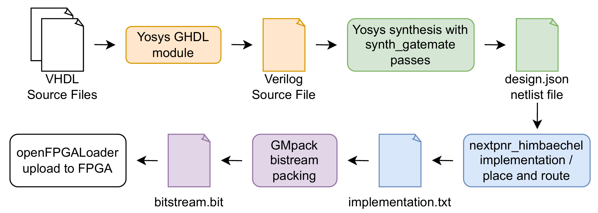

### VHDL workflow

This folder contains the VHDL source files, constraints and a makefile to build the project for the CologneChip GateMate M1A1 FPGA Board.

Tools within the [OSS-CAD-Suite](https://github.com/YosysHQ/oss-cad-suite-build/releases) by YoysyHQ (tested with Build 21-01-2026) have been used for synthesis, implementation, bitstream packing and bitstream uploading.



Building the data concentrator project for two W5500s connected to the PMOD pins:

Inside the root directory of the OSS-CAD-Suite

```bash
source environment
```

Inside the HDL folder:

```bash
make all
```

Test W5500 functionality:

```bash
make w5500_all
```

GHDL + GTKwave simulations:

```bash
make sim_spimaster
make sim_w5500
make sim_dc
make sim_all
```

## Data Concentrator


Features: 
- 8-bit data AXI-stream based data flow
- Low latency deterministic interlock assertion in the Threshold Logic Units
- Glitch filter with hysteresis behavior for external interlock signals
- 8 priority levels (encoded in 3 bit USER field)
- sending an "INTERLOCK" or "ALMOSTFULL" alert by the Telemetry Sender


Adding new devices to the Threshold Lookup Memory can be done using the threshold_address_generator.py script.

Usage: 
```bash
python3 threshold_address_generator.py
```